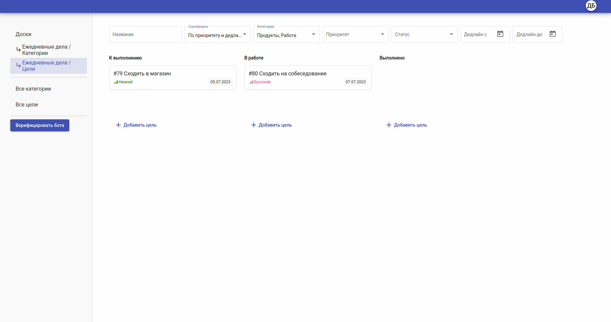

# Todo List

Todo List is a user-friendly website that helps you stay organized and manage your tasks effectively. Create an account or log in to access your personalized dashboard. From there, you can easily create tasks, set due dates, and assign priorities.



## Requirements

* Docker version 23.0.6
* Django 4.2.3

## Build

```bash
sudo docker-compose up --build
```
